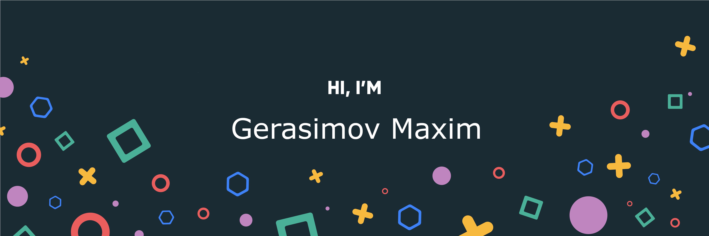

## Hi there 👋

I'm Maxim, a young **Data Scientist**, creative programmer with **Time Series and NLP**.
I develop various models for practical purposes, create libraries for other programmers, and also quite often participate in professional activities.

Want to know more about me?

I am successfully completing my first year at **Yandex.Lyceum**, as well as courses at **Tinkoff Education**,
I often participate in **hackathons** to develop my **hard and soft skills**.

## &#x1f4c8; GitHub Stats

 

 
 

## 💼 Skills

More Skills

 

 

